 

**I build reliable, observable systems that turn messy inputs into explainable signals in regulated environments.**

 

---

## About

- Senior Data Engineer at Nationale-Nederlanden (Fmr: Finance & Risk data platforms. Present: Cloud FinOps Platform)
- Build and operate Azure + Databricks pipelines with strong governance, CI/CD, and cost attribution
- Background in banking and insurance, with a strong bias for reliability over novelty
- Interested in how decision systems behave under uncertainty and imperfect data
- Based in Arnhem, Netherlands

---

## What I'm Working On

📊 **Multi-market equity intelligence.** Research desks for the Nigerian Exchange and the JSE that ingest fundamentals, disclosures, and news, then score every listed name into one explainable conviction number.

⛓️ **On-chain data infrastructure.** Real-time ingestion and analytics across Solana, EVM, and Sui, built on a chain-agnostic core.

🧪 **Honest validation as a discipline.** Applying the same bar everywhere: out-of-sample tests, walk-forward checks, realistic cost, and a framework built to reject overfit edges rather than rationalize them.

---

## Featured Work

| Project | What it is |
|---|---|
| **[OnchainIQ](https://github.com/miztachristian/OnchainIQ)** | Real-time on-chain data and trading-research infrastructure. Streaming ingestion (gRPC / WSS / SSE), a composable risk-filter pipeline, MEV-aware execution, and an out-of-sample backtest core spanning Solana, EVM, and Sui. |
| **[NaijaAlphas](https://github.com/miztachristian/NaijaAlphas)** | Equity intelligence for the Nigerian Exchange. Ingests fundamentals, NGX disclosures, annual reports, news, and macro, then fuses eight signals into one explainable 0 to 100 conviction score with a clear action. |
| **[JSE Stock Analysis & Backtesting](https://github.com/miztachristian/South-African-Stocks-System)** | Quantitative research platform for the Johannesburg Stock Exchange. Combined decision engine, hidden-gems and blue-chip screeners with safety gates, seasonality analysis, and a vectorized momentum backtester across 245+ stocks. |
| **[AlphaGate](https://github.com/miztachristian/AlphaGate)** | Algorithmic trading and regime-gating engine. Every candidate signal must clear ten checks before it reaches you. Anything that fails is suppressed by default, not passed through with a warning. |
| **[OranjeWheel](https://github.com/miztachristian/OranjeWheel)** | Combinatorial coverage engine for the Dutch Lotto. Builds abbreviated covering designs and proves the guarantee exhaustively, verifying all 495 possible outcomes before a ticket is ever printed. |

**Also building**

- **Legal Claim Triage System.** Intake intelligence for personal injury law firms to pre-assess claims before human review.

---

## Legal Claim Triage: Clarification

This system does **not** provide legal advice.

It supports intake by:
- guiding claimants through a structured narrative
- normalizing inputs into machine-readable data
- applying explicit, auditable rule checks
- producing a triage signal and intake summary for lawyers

Explainability and disclaimers are non-negotiable.

---

## Tech Stack

**Cloud & Data Platforms**
Microsoft Azure, AWS, Databricks, Delta Lake, Azure Data Factory, ADLS Gen2, Azure SQL.

**Data Engineering**
Python, SQL, PySpark, ETL/ELT, data modelling, medallion architecture, data quality, data pipeline development, data warehousing.

**DevOps & IaC**
Azure DevOps, CI/CD, Terraform, ARM/Bicep, Git, PowerShell.

**Observability & FinOps**
Azure Monitor, Log Analytics, Application Insights, cloud cost management (FinOps).

**Ways of working**
Agile/Scrum, stakeholder management, technical mentoring.

---

## Certifications

**Active**

- FinOps Certified Practitioner, FinOps Foundation (2025)
- FinOps Certified: FinOps for AI, FinOps Foundation (2026)
- Microsoft Certified Trainer (MCT), Microsoft (2022 to 2026)
- Azure DevOps Engineer Expert (AZ-400), Microsoft (2023)
- Azure Administrator Associate (AZ-104), Microsoft (2023)
- TOGAF 9 Foundation, The Open Group (2023)
- Professional Scrum Master I & Product Owner I, Scrum.org (2022)

**Previously certified**

- Azure Solutions Architect Expert (AZ-305), 2023 to 2026
- Azure Data Engineer Associate, 2021 to 2025
- AWS Cloud Practitioner, 2022 to 2025
- HashiCorp Terraform Associate, 2022 to 2024

---

## Engineering Philosophy

I optimize for systems that are:
- predictable in production
- observable under failure
- explainable to non-engineers
- boring when they're working correctly

If a system feels clever in production, it's probably fragile.

---

**Open to conversations about Cloud & Data platforms, Decision systems, GenAIOps and FinOps.**

[christianonyekwe.dev](https://christianonyekwe.dev) &nbsp;·&nbsp; [LinkedIn](https://www.linkedin.com/in/christianonyekwe/) &nbsp;·&nbsp; Arnhem, Netherlands

